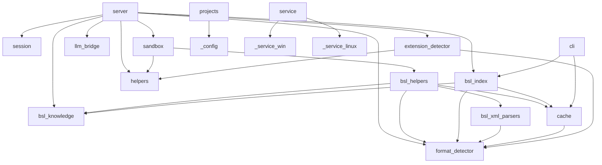

# Карта модулей

## Группы модулей

### Точки входа
- **`__init__.py`** — пакет, публичный API (`__version__`)
- **`__main__.py`** — `python -m rlm_tools_bsl` → запуск MCP-сервера
- **`cli.py`** — CLI `rlm-bsl-index` (build / update / info / drop) → `bsl_index`, `cache`
- **`server.py`** — MCP-сервер (5 тулов: rlm_projects, rlm_index, rlm_start, rlm_execute, rlm_end) → `session`, `sandbox`, `llm_bridge`, `format_detector`, `extension_detector`, `bsl_knowledge`, `bsl_index`, `helpers`

### Сессии и песочница
- **`session.py`** — SessionManager, двухуровневый TTL (idle/active), `build_session_manager_from_env()` → _(нет внутренних зависимостей)_
- **`sandbox.py`** — Sandbox (exec Python в изолированном окружении с хелперами) → `helpers`, `bsl_helpers`

### BSL-логика
- **`bsl_helpers.py`** — 51 хелпер-функция для анализа BSL/1С (регистрируются через `_reg()`) → `format_detector`, `bsl_knowledge`, `cache`, `bsl_xml_parsers`
- **`bsl_knowledge.py`** — стратегия анализа, бизнес-рецепты, WORKFLOW, INDEX TIPS → _(нет внутренних зависимостей)_
- **`bsl_index.py`** — SQLite-индекс (22 таблицы, IndexBuilder, IndexReader, FTS5) → `bsl_knowledge`, `cache`, `format_detector`
- **`bsl_xml_parsers.py`** — парсеры XML-метаданных 1С (CF и EDT форматы) → `format_detector`

### Детектирование формата
- **`format_detector.py`** — определение CF/EDT, парсинг путей BSL-файлов → _(нет внутренних зависимостей)_
- **`extension_detector.py`** — обнаружение расширений 1С и переопределений методов → `format_detector`, `helpers`

### Инфраструктура
- **`helpers.py`** — общие утилиты (smart_truncate, normalize_path, format_table) → _(нет внутренних зависимостей)_
- **`cache.py`** — дисковый кеш BSL-файлов (`~/.cache/rlm-tools-bsl/<hash>/`) → `format_detector`
- **`llm_bridge.py`** — OpenAI-совместимый LLM-клиент (батчинг, retry) → _(нет внутренних зависимостей)_
- **`projects.py`** — реестр проектов (name → path, `projects.json`) → `_config`
- **`_config.py`** — загрузка конфигурации, поиск `.env` и `service.json` → _(нет внутренних зависимостей)_
- **`_format.py`** — форматирование вывода (presentation layer) → _(нет внутренних зависимостей)_

### Сервис
- **`service.py`** — управление сервисом (install / start / stop / status) → `_service_win` (Windows), `_service_linux` (Linux)
- **`_service_win.py`** — реализация Windows-сервиса через pywin32
- **`_service_linux.py`** — реализация Linux systemd --user юнита

## Граф зависимостей

